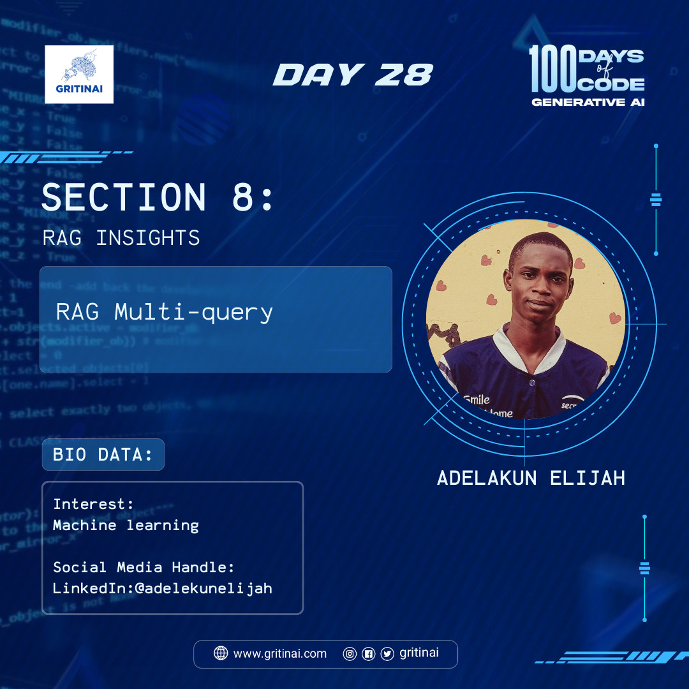

# Day 28

## RAG Multi-query

Welcome to Day 28 of the 100 Days of Code challenge!

Today you will learn to handle multiple queries simultaneously and retrieve relevant information from external knowledge sources to generate contextually appropriate responses for each query. 

Get [Started](https://youtu.be/JChPi0CRnDY?si=oNStN1DV8v-yhXCT)

