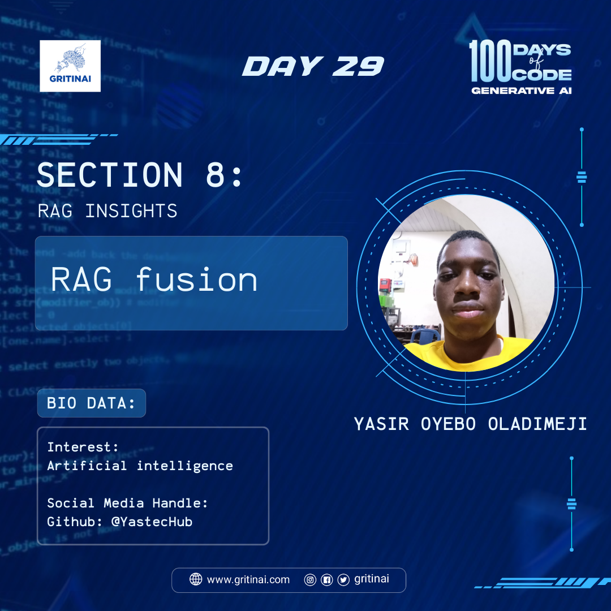

# Day 29

## RAG Fusion

Welcome to Day 29 of the 100 Days of Code challenge!

Today you will learn to combine the knowledge retrieval capabilities of RAG with the text fusion capabilities of Fusion models to generate high-quality, coherent, and accurate text. 

Explore RAG Fusion [here](https://youtu.be/77qELPbNgxA?si=qVfarlP-WxHp4hfP)

