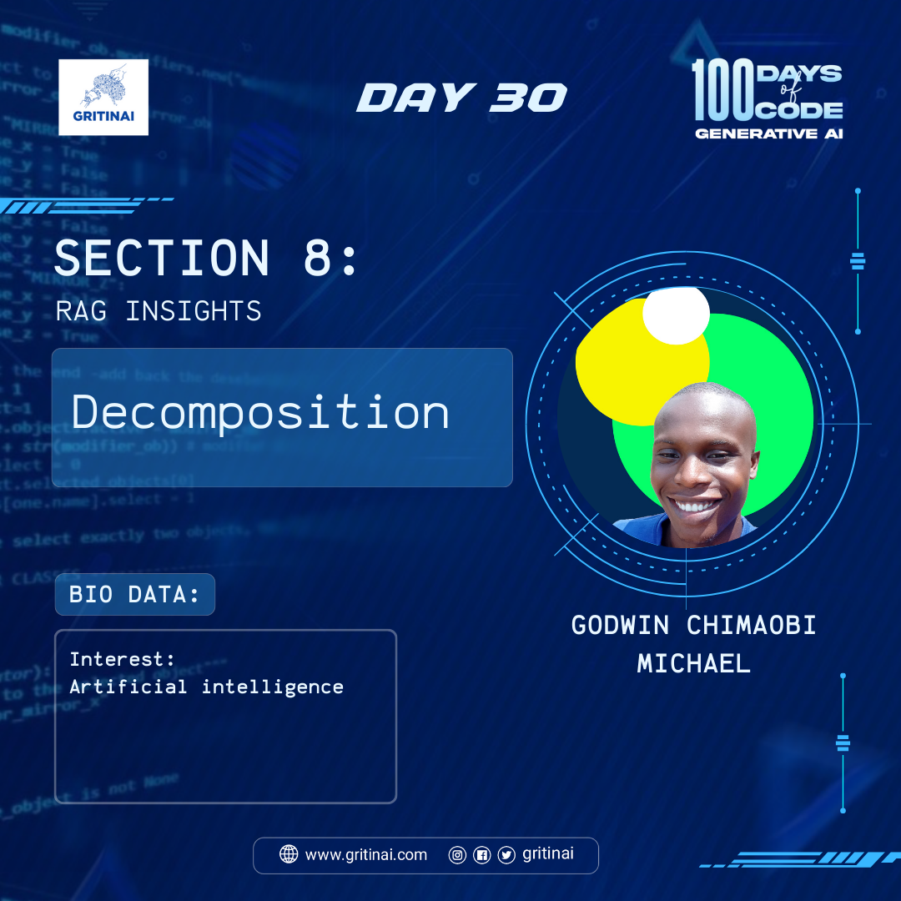

# Day 30

## Decomposition  
   
Welcome to Day 30 of the 100 Days of Code challenge\!

Today you will learn about Query decomposition. This is a strategy used to improve question-answering by breaking down a question into sub-questions. These can either be (1) solved sequentially or (2) independently answered followed by consolidation into a final answer. 

Learn more about [query decomposition](https://youtu.be/77qELPbNgxA?si=qVfarlP-WxHp4hfP)

