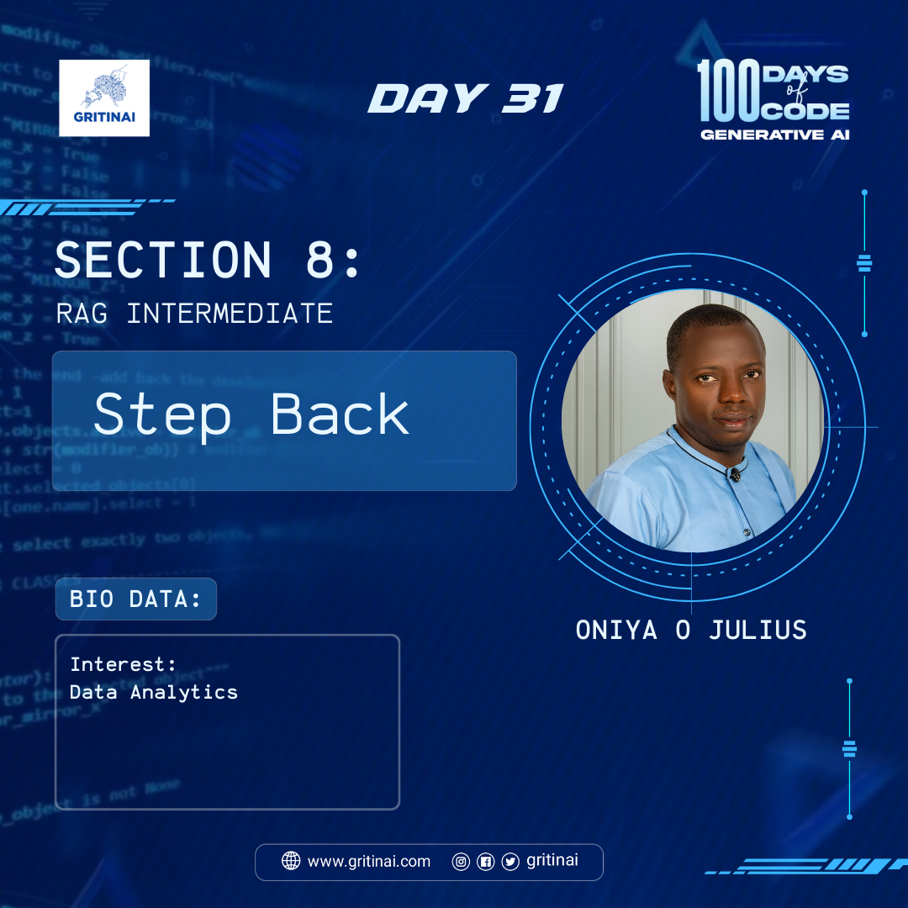

# Day 31

## RAG Intermediate \- Step Back 

Welcome to Day 31 of the 100 Days of Code challenge!

Today we will learn about Step-back prompting which is an approach to improve retrieval that builds on chain-of-thought reasoning. From a question, it generates a step-back (higher level, more abstract) question that can serve as a precondition to correctly answering the original question. This is especially useful in cases where background knowledge or more fundamental understanding is helpful to answer a specific question.

Learn more [here](https://youtu.be/xn1jEjRyJ2U?si=z5dr-2pyVCGP8qZk)

