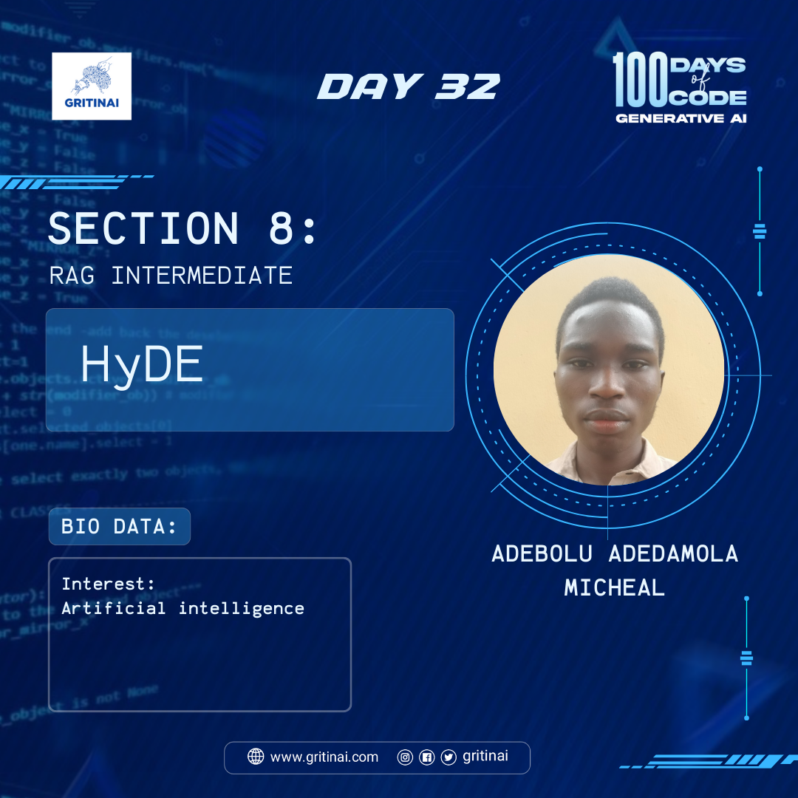

# Day 32 

## RAG Intermediate \- Hyde

Welcome to Day 32 of the 100 Days of Code challenge!

Today we will learn about HyDE\!

HyDE (Hypothetical Document Embeddings) is an approach to improve retrieval that generates hypothetical documents that could be used to answer the user input question. These documents, drawn from the LLMs knowledge, are embedded and used to retrieve documents from an index. The idea is that hypothetical documents….learn [more](https://youtu.be/SaDzIVkYqyY?si=WRIMJ1qhE3xteD-C)

