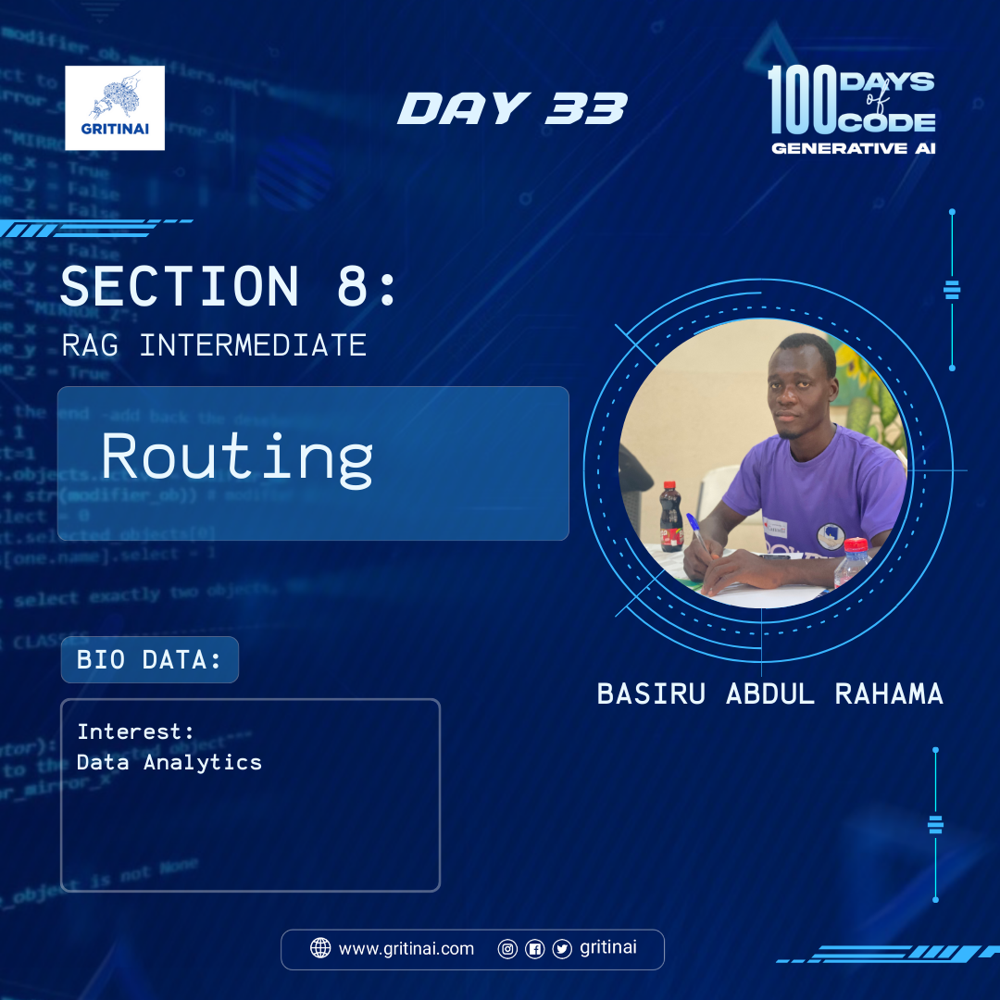

# Day 33

## RAG Intermediate \- Routing 

Welcome to Day 33 of the 100 Days of Code challenge!

Today we will focus on the different types of [query routing](https://youtu.be/pfpIndq7Fi8?si=uZfYTBiqA4MGTDLX) 

1. Logical   
2. Semantic

Routing is basically routing potentially different question to the right source, in many cases it might be a different database. learn more [here](https://youtu.be/pfpIndq7Fi8?si=uZfYTBiqA4MGTDLX)

