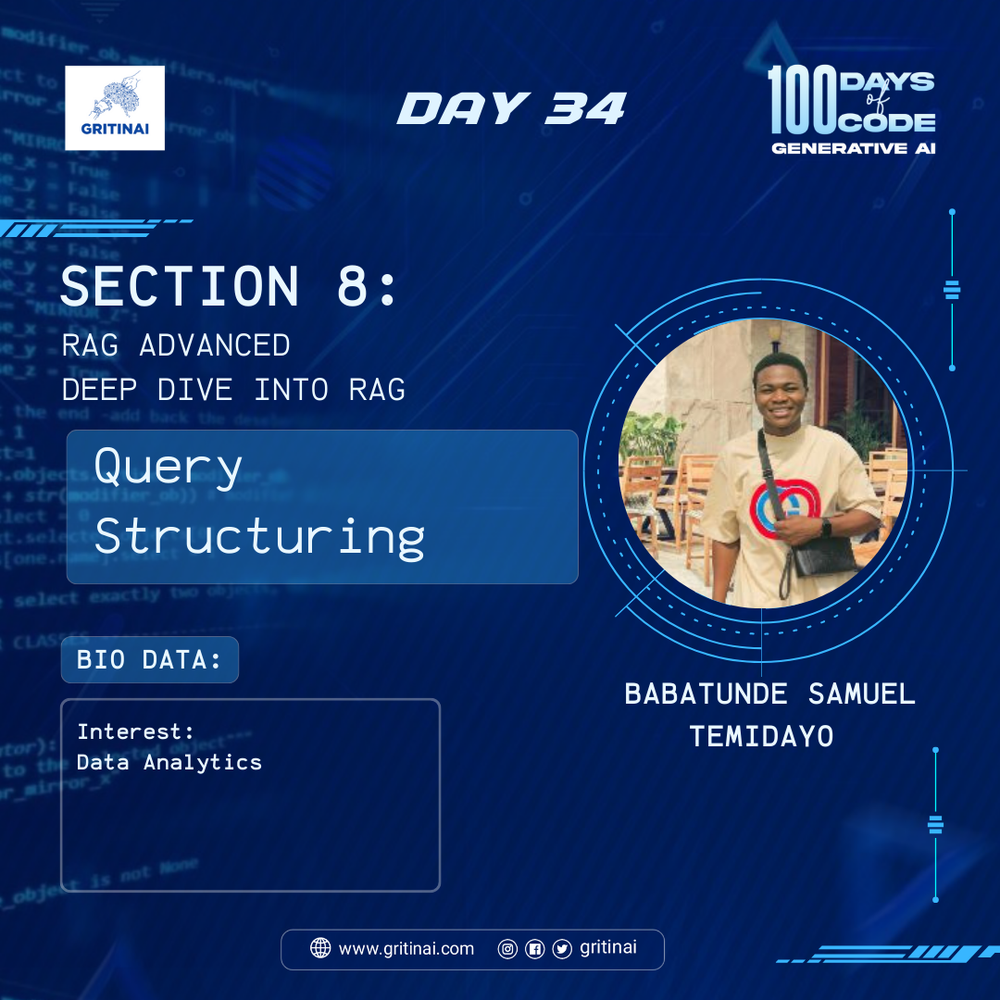

# Day 34 

## Query Structuring 

Welcome to Day 34 of the 100 Days of Code challenge!

RAG systems ingest questions in natural language but we interact w/ databases using domain-specific languages (e.g., SQL, Cypher for Relational and Graph DBs). And, many vectorstores have metadata that can allow for structured queries to filter chunks. Let’s [dive](https://youtu.be/kl6NwWYxvbM?si=9cekJCKgMj_tUhHk) into how user questions are converted into structured queries.

