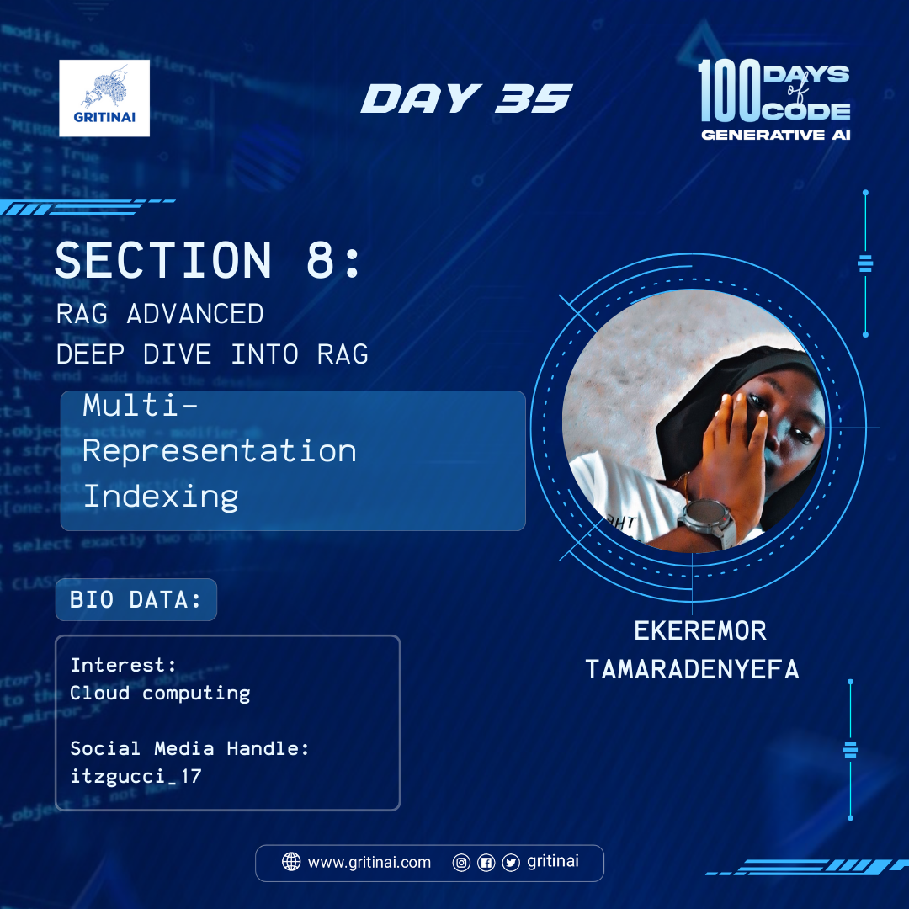

# Day 35 

## Multi-Representation Indexing

Welcome to Day 35 of the 100 Days of Code challenge!

Many RAG approaches focus on splitting documents into chunks and returning some number upon retrieval for the LLM. But chunk size and chunk number can be brittle parameters that many users find difficult to set; both can significantly affect results if they do not contain all context to answer a question.

Today we will learn some useful tricks for indexing full documents. Check it [out](https://youtu.be/gTCU9I6QqCE?si=B2hKU80eVBYfJARR).

