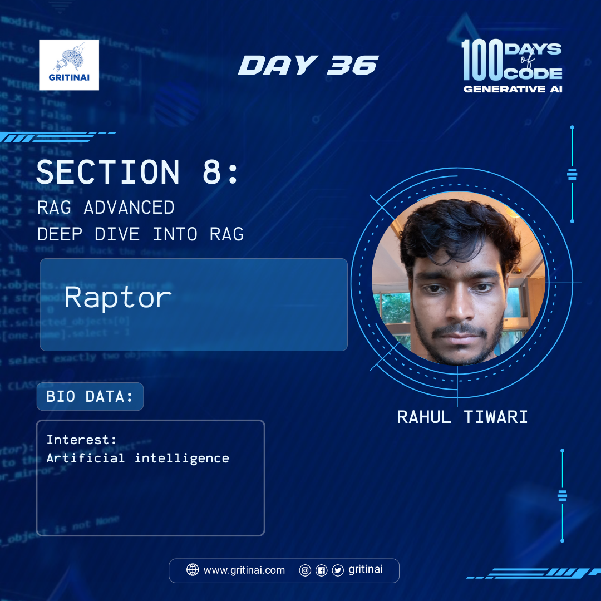

# Day 36

## Deep Dive into RAG \- Raptor

Welcome to Day 36 of the 100 Days of Code challenge!

Today we will learn a technique used in RAG (Retrieval-Augmented Generation) systems to handle both "lower-level" and "higher-level" questions. Raptor is a sparse retrieval method that enables the model to retrieve relevant documents and passages across a large corpus, even if they are not among the top-k nearest neighbors.

Raptor is particularly useful for handling "higher-level" questions that require distilling ideas across multiple documents. By using Raptor, RAG systems can retrieve a larger set of relevant documents and passages, allowing the model to generate more accurate and informative responses….learn [more](https://youtu.be/z_6EeA2LDSw?si=MK9ehP947BKkRkRZ)

