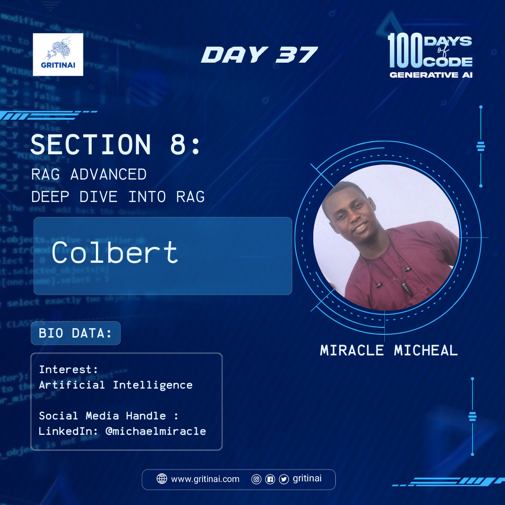

# Day 37

## Deep Dive into RAG \- Colbert

Welcome to Day 37 of the 100 Days of Code challenge

Another technique used in RAG systems is  ColBERT (COLlar-based BERT), it is used to improve the efficiency and effectiveness of retrieval. ColBERT uses a late-interaction approach, where the query and documents are represented as collections of embeddings, and the similarity is computed between these collections….learn this technique [here](https://youtu.be/cN6S0Ehm7_8?si=GU_kiR1klr_H7NFD)

