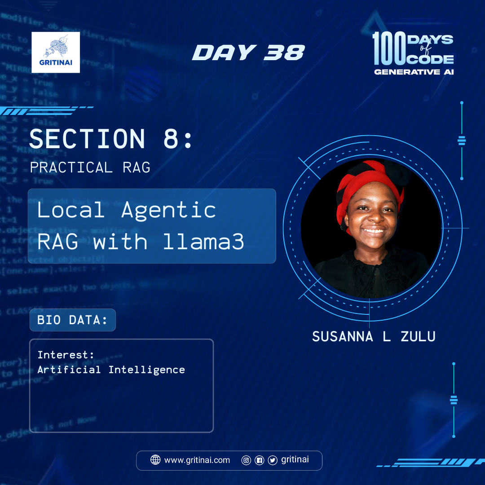

# Day 38

## Local Agentic RAG with llama3

Welcome to Day 38 of the 100 Days of Code challenge  
Local Agentic RAG is a variant of the RAG architecture that focuses on using local knowledge to generate responses. By incorporating LLaMA3, a large language model, into the Local Agentic RAG framework, you can leverage the strengths of both models to generate high-quality responses….let’s explore how it works [here](https://www.youtube.com/watch?v=u5Vcrwpzoz8)

