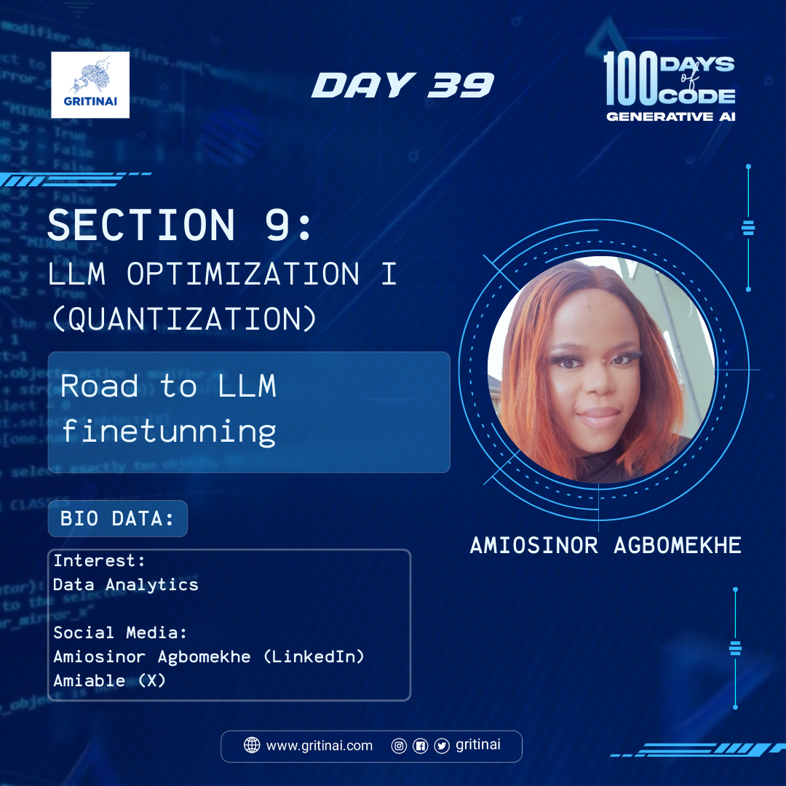

# Day 39

## Road to LLM finetunning

Welcome to Day 39 of the 100 Days of Code challenge  
Today we will learn about finetuning LLM. The road to LLM finetuning involves pretraining a large language model, preparing a dataset, selecting and configuring the model, finetuning, evaluating, and iterating to optimize performance on a specific task.

Key Topic for Today:

[Quantization](https://youtu.be/6S59Y0ckTm4?si=J28Jb5hFcWlInQLP): This is a common technique used to reduce the model size, though it can sometimes result in reduced accuracy.

