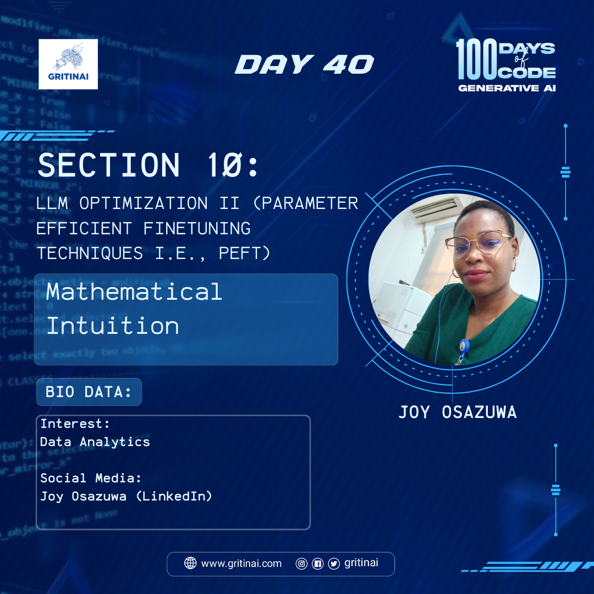

# Day 40

## Mathematical Intuition 

Welcome to Day 40 of the 100 Days of Code challenge!

Today we will be learning about some finetuning techniques which is called as LoRA and QLoRA techniques, low order rank adaptation, and quantized Lora.

Let’s get [started](https://youtu.be/l5a_uKnbEr4?si=DZEQ_wQETCsNSn-U)\!

