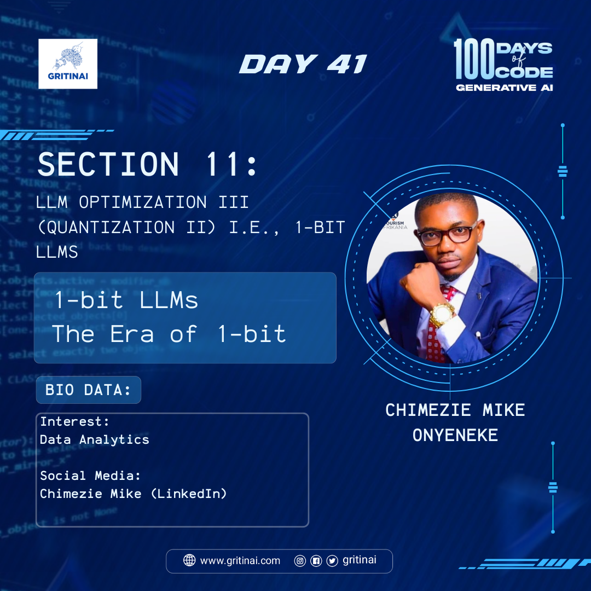

# Day 41

## 1-bit LLMs \- The Era of 1-bit 

Welcome to Day 41 of the 100 Days of Code challenge!

1-bit LLMs (Large Language Models) refer to a new generation of language models that use 1-bit precision (binary) weights and activations, instead of the traditional 32-bit floating-point precision.

What are the implications of this innovation? Find out more [here](https://youtu.be/wN07Wwtp6LE?si=QaId_RC0CbZWGbkq)

