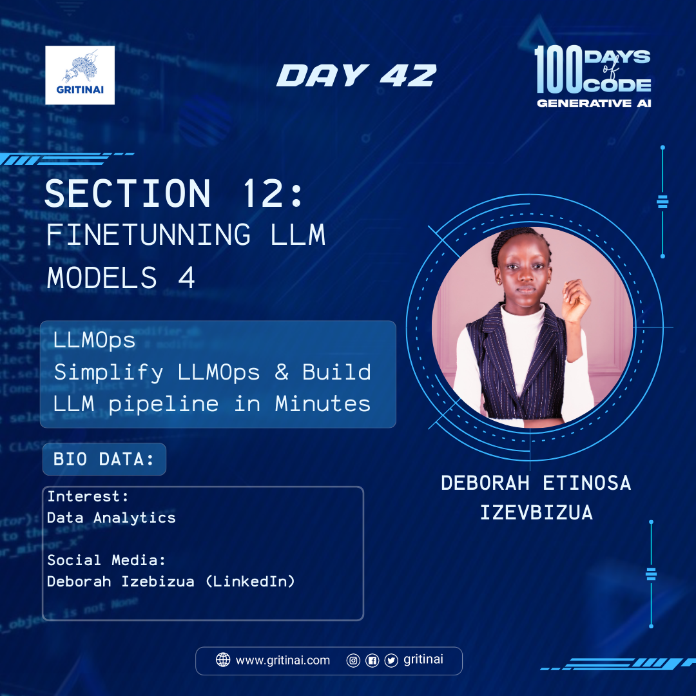

# Day 42

## Simplify LLMOps & Build LLM pipeline in Minutes

Welcome to Day 42 of the 100 Days of Code challenge!

Today, we will learn how to quickly build and deploy an LLM pipeline. LLMOps (Large Language Model Operations) simplifies the deployment and management of large language models. To build an LLM pipeline in minutes, watch this [video](https://youtu.be/4ijnajzwor8?si=lDeWNZvt_p65CMon).

