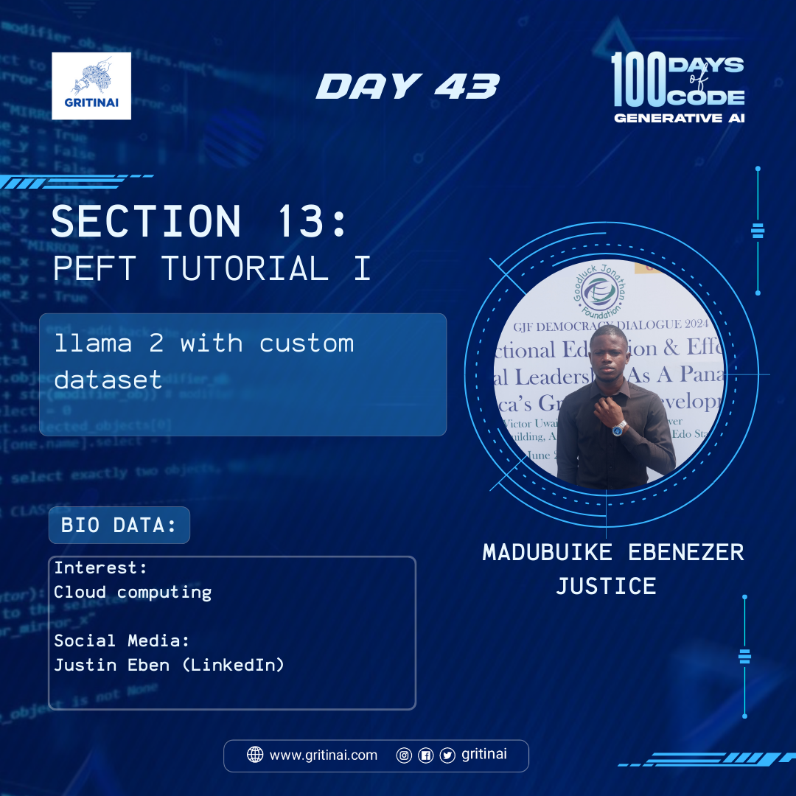

# Day 43

## Llama 2 with Custom Dataset

Welcome to Day 43 of the 100 Days of Code challenge!

Today we will be discussing how we can fine tune LLAMA 2 model with custom dataset using parameter efficient Transfer Learning  using LoRA :Low-Rank Adaptation of Large Language Models.

Note that by fine-tuning LLaMA 2 on your custom dataset, you can create a highly specialized language model that excels in your specific use case. Check it [out](https://youtu.be/Vg3dS-NLUT4?si=YoVlwnCyIv3Xm-c8)

