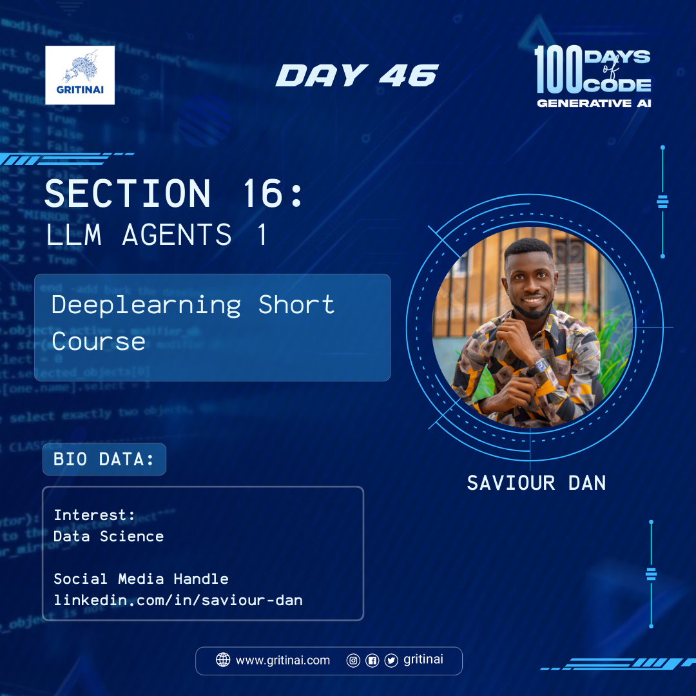

# Day 46

## LLM Agent 1 \- Deep Learning Short Course 

In this course you will learn to build an agent from scratch using Python and an LLM, and then you will rebuild it using LangGraph, learning about  its components and how to combine them to build flow-based applications.

Enroll [now](https://www.deeplearning.ai/short-courses/ai-agents-in-langgraph/).

