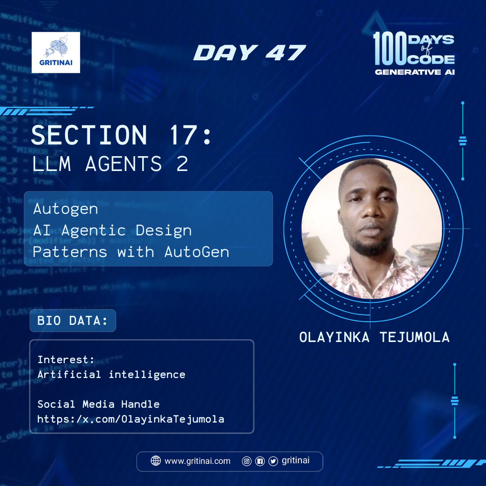

# Day 47 

## AI Agentic Design Patterns with AutoGen

Welcome to Day 47 of the 100 Days of Code challenge!

Today we will learn about AutoGen. This is a tool that generates code for AI models, and when combined with AI Agentic Design Patterns, it enables the creation of autonomous AI systems that can adapt and learn. Learn more about [AutoGen](https://www.deeplearning.ai/short-courses/ai-agentic-design-patterns-with-autogen/).

