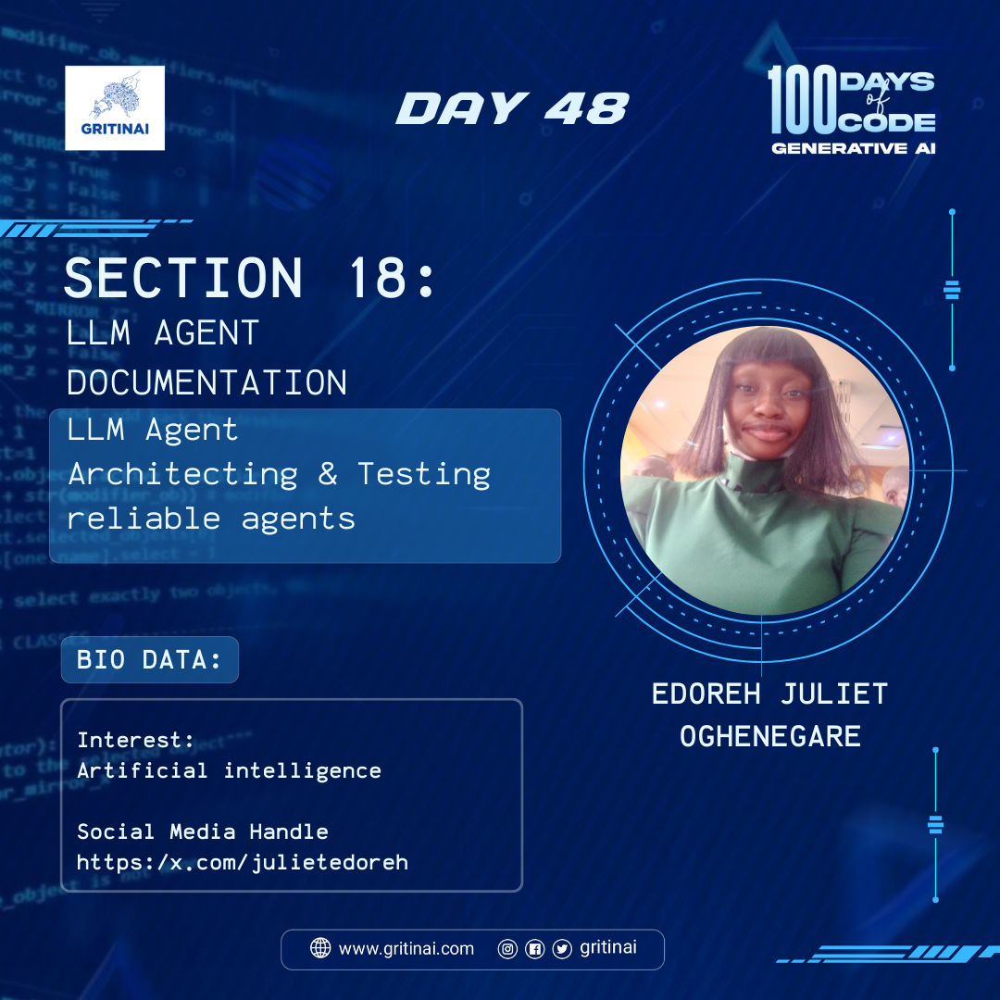

# Day 48

## Architecting & Testing reliable agents

Welcome to Day 48 of the 100 Days of Code challenge!

Architecting and testing reliable agents is crucial for ensuring that autonomous systems operate correctly and make informed decisions. 

The best practices includes:

* Use established development frameworks and libraries  
* Implement robust error handling and exception handling  
* Conduct regular code reviews and testing  
* Utilize continuous integration and deployment pipelines  
* Monitor agent performance and update as needed

Check out the [slide](https://docs.google.com/presentation/d/1QWkXi4DYjfw94eHcy9RMLqpQdJtS2C_kx_u7wAUvlZE/edit#slide=id.g273e7f400bc_0_0) to learn more

