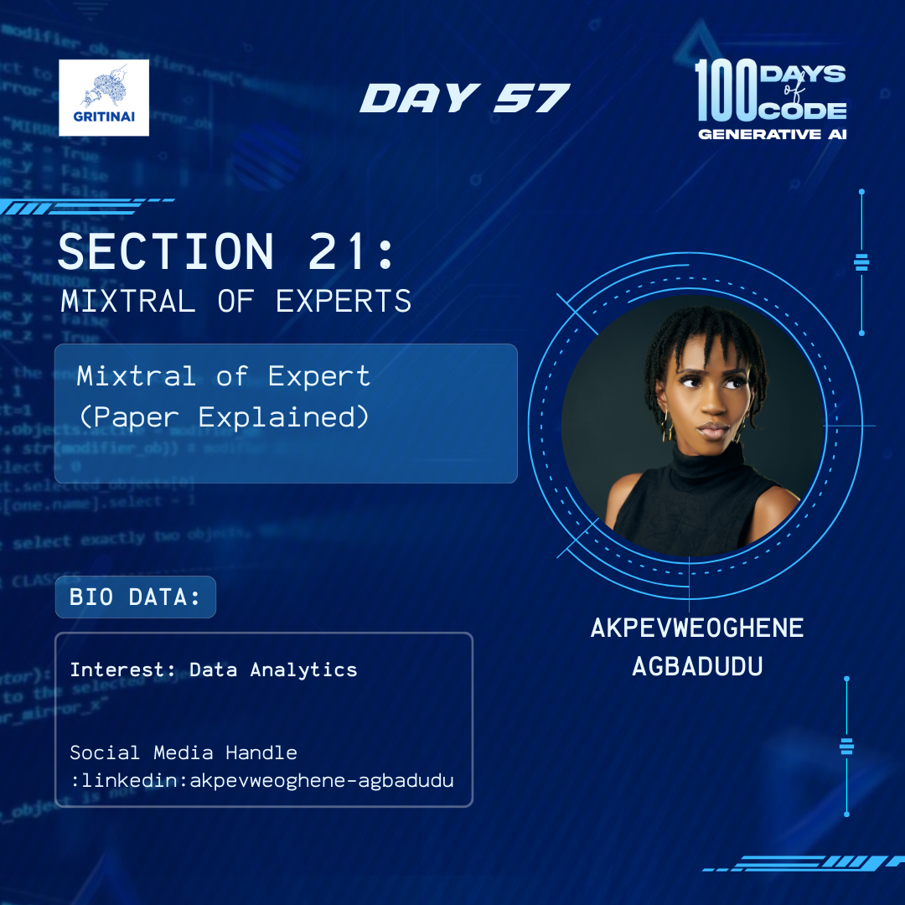

# Day 57

## Learning PyTorch B

Welcome to Day 57 of the 100 Days of Code challenge!

Today we will learn how to build deep learning models with PyTorch and Python. Let’s make PyTorch a bit more approachable for people starting out with deep learning and neural networks. 

We will focus on the first 4 hours of [PyTorch](https://www.youtube.com/watch?v=GIsg-ZUy0MY) and learn:

* PyTorch Basics & Linear Regression  
* Image Classification with Logistic Regression  
* Training Deep Neural Networks on a GPU with PyTorch

