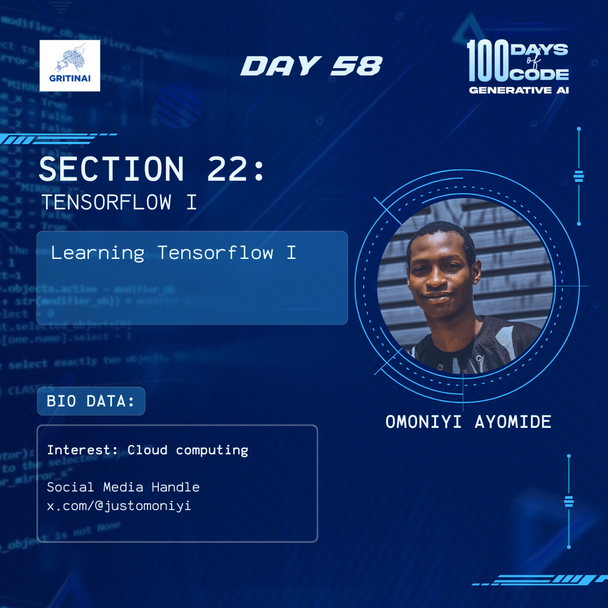

# Day 58

## Learning PyTorch B

Welcome to Day 58 of the 100 Days of Code challenge!

Yesterday, we were able to focus on the first part of [PyTorch](https://www.youtube.com/watch?v=GIsg-ZUy0MY). Today we will continue from [4:44:51](https://www.youtube.com/watch?v=GIsg-ZUy0MY&t=17091s) and explore the following concepts:

* Image Classification using Convolutional Neural Networks  
* Residual Networks, Data Augmentation and Regularization  
* Training Generative Adverserial Networks (GANs)

At the end of this tutorial, you should have a good grasp of PyTorch. 

Have fun learning\!

