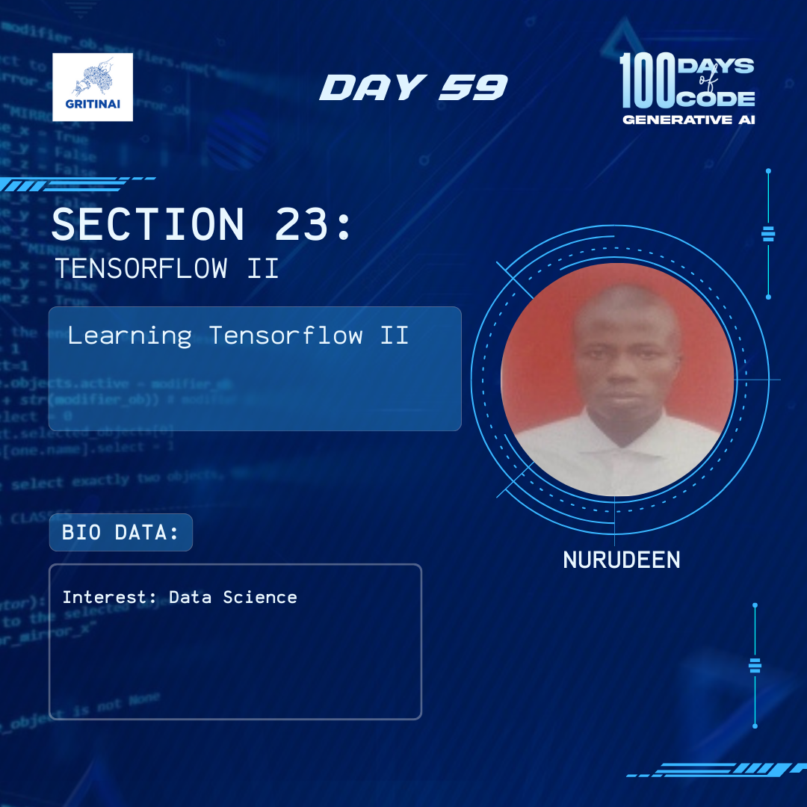

# Day 59

## Tensorflow vs PyTorch

Welcome to Day 59 of the 100 Days of Code challenge!

Over the past few days, we have explored Tensorflow and PyTorch. Now, let’s look into the interplay and disparities of the two frameworks.

Check it out [here](https://www.youtube.com/watch?v=4L86D_fU6sQ)

