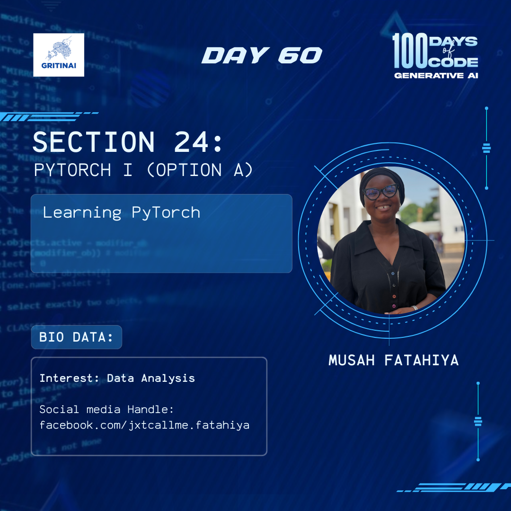

# Day 60

## Other Deep Learning Frameworks I

Welcome to Day 60 of the 100 Days of Code challenge!

We have explored tensorflow and pytorch, let’s take a look at other frameworks for deep learning like Jax, Flax and Mxnet.

Check it out [here](https://www.youtube.com/watch?v=fIPBP075Cfo)

