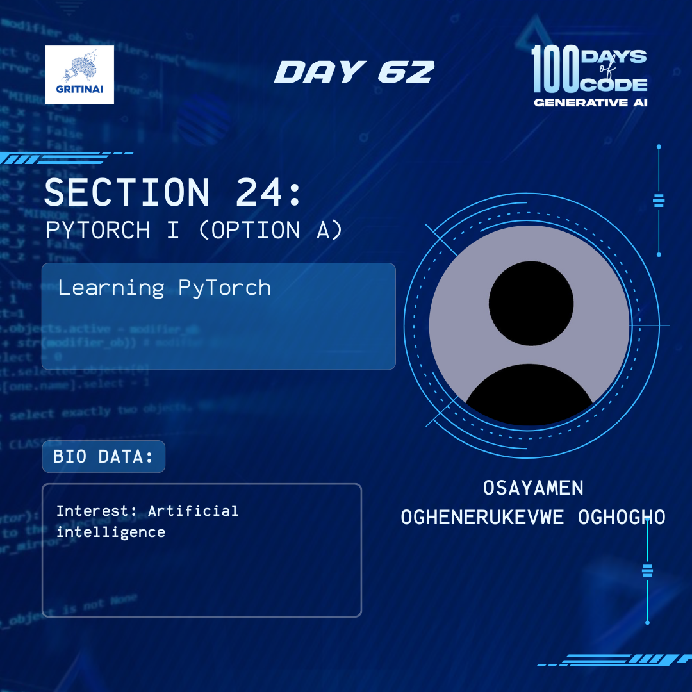

# Day 62

## Other Deep Learning Frameworks III

Welcome to Day 62 of the 100 Days of Code challenge!

There are many deep learning frameworks out there that make it easier for you to implement neural networks. A good grasp of matrix multiplication and basic python programming will make today’s learning seamless. You should brush up on the duo or just dive into today’s lesson [here](https://www.youtube.com/watch?v=AK6r-llqogg)

