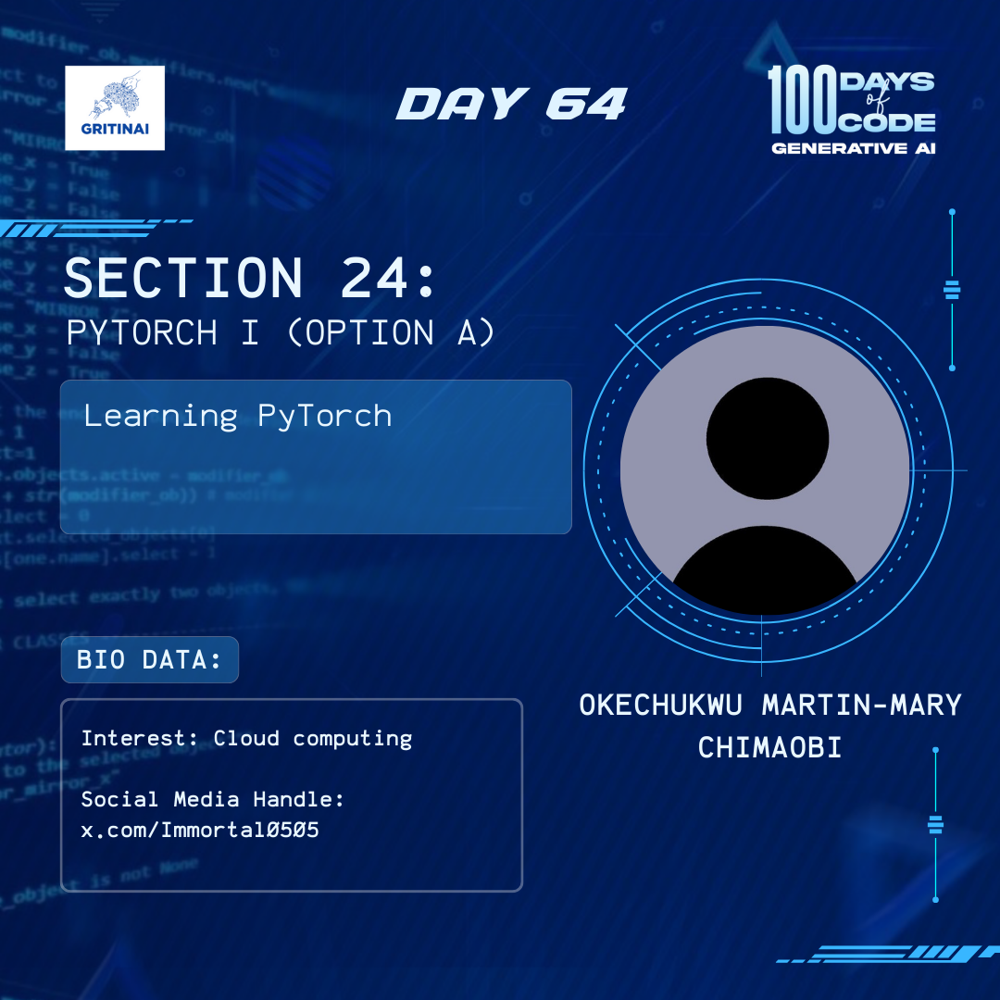

# Day 64

## Autoencoders (AE) I (Option B)

Welcome to Day 64 of the 100 Days of Code challenge!

Do you know that An autoencoder is an unsupervised learning technique? But what does that really mean?

Today we will take another approach in exploring what autoencoders really are. Check it out [here](https://www.youtube.com/watch?v=zp8clK9yCro)

