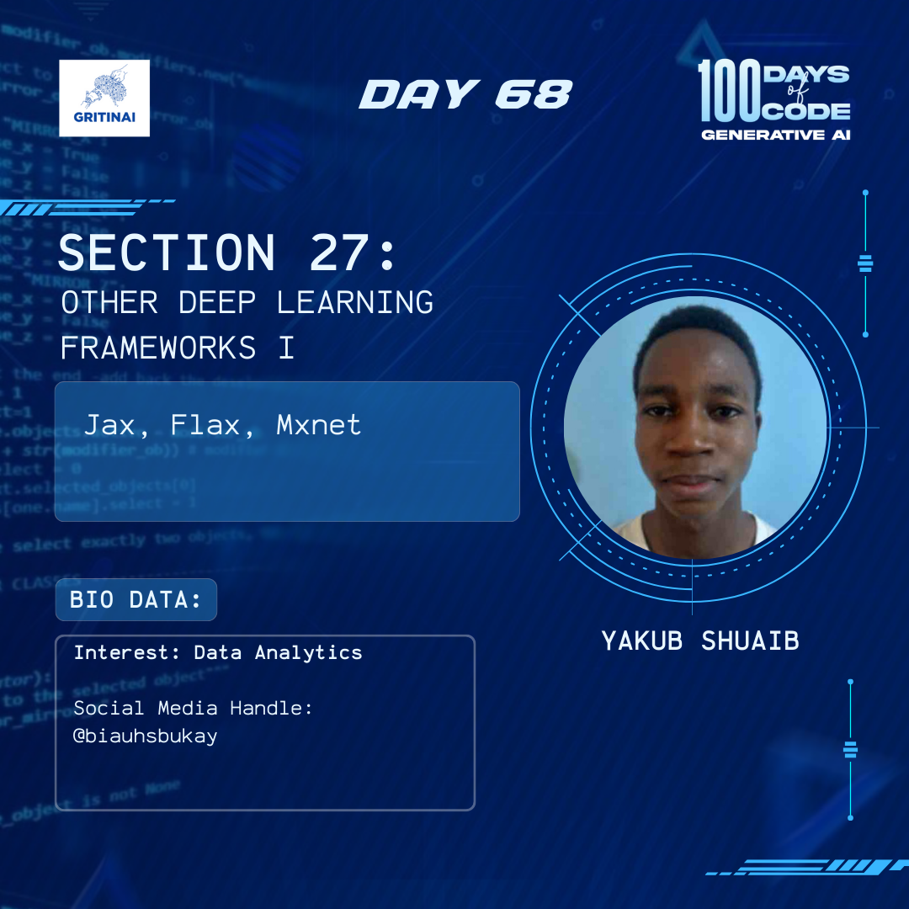

# Day 68

## Generative Adversarial Networks (GANs) I

Welcome to Day 68 of the 100 Days of Code challenge!

Generative Adversarial Networks (GANs) pit two different deep learning models against each other in a game. Let’s listen to Martin Keen with IBM, explain how this competition between the generator and discriminator can be utilized to both create and detect how you can benefit from the competition.

Check it out [here](https://www.youtube.com/watch?v=TpMIssRdhco)

