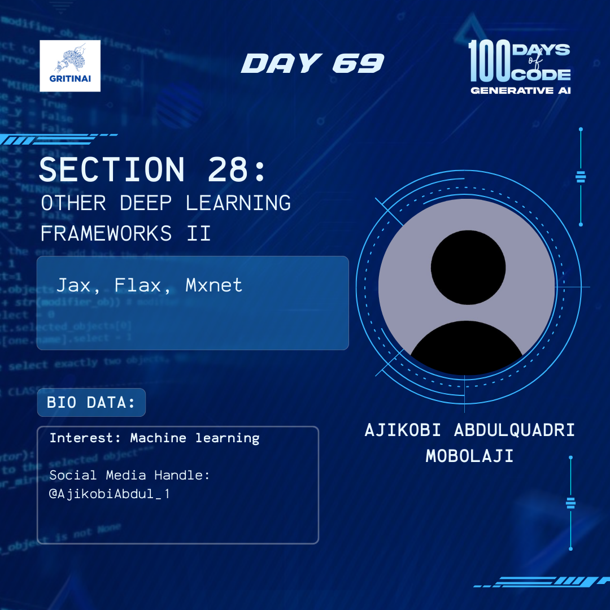

# Day 69

## Generative Adversarial Networks (GANs) I

Welcome to Day 69 of the 100 Days of Code challenge!

Today, we will rewatch Martin Keen explaining the competition between the generator and discriminator can be utilized to both create and detect how you can benefit from the competition. Pay attention to details on Zerosum Game.

Check it out [here](https://www.youtube.com/watch?v=TpMIssRdhco)

