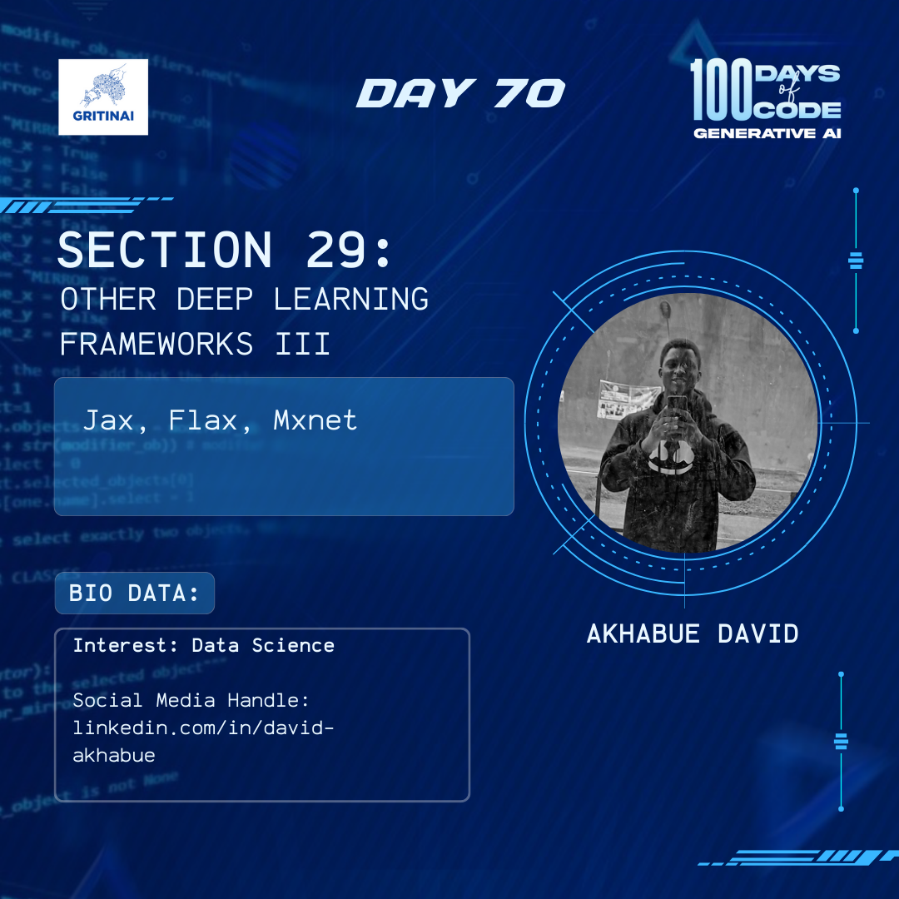

# Day 70

## Generative Adversarial Networks (GANs) II

Welcome to Day 70 of the 100 Days of Code challenge!

We already learnt that Generative adversarial networks (GANs) are deep learning architectures that use two neural networks (Generator and Discriminator), competing one against the other.  But what you don’t know yet is that the generator tries to create realistic looking fake data (e.g. images) and the discriminator tries to classify whether the data is real or fake.

Today we are going to learn all about that [here](https://www.youtube.com/watch?v=xBX2VlDgd4I&list=PLZsOBAyNTZwboR4_xj-n3K6XBTweC4YVD)

