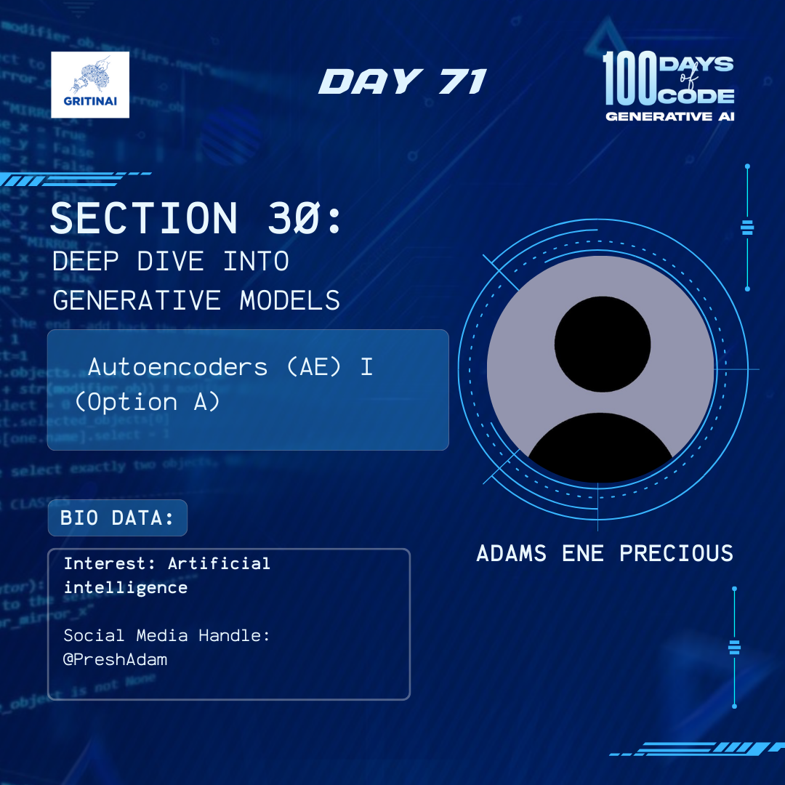

# Day 71

## Generative Adversarial Networks (GANs) II

Welcome to Day 71 of the 100 Days of Code challenge!

The generator and discriminator are trained simultaneously, competing against each other in a minimax game. The generator improves in generating realistic data, while the discriminator becomes more proficient in distinguishing real from generated data. Today we will learn about this process and apply it.

Today we are going to learn all about that [here](https://www.youtube.com/watch?v=xBX2VlDgd4I&list=PLZsOBAyNTZwboR4_xj-n3K6XBTweC4YVD)

