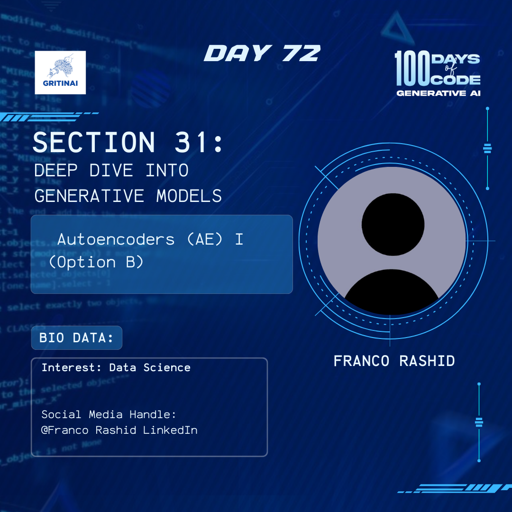

# Day 72

## Conditional GANs (CGANs)

Welcome to Day 72 of the 100 Days of Code challenge!

Today we will learn how a GAN can be trained so that both the generator and the discriminator models are conditioned on the class label (or other modalities). This usually results in the trained generator model being used to generate images of a given type using the class label (or another condition). 

Click  [here](https://www.youtube.com/watch?v=xBX2VlDgd4I&list=PLZsOBAyNTZwboR4_xj-n3K6XBTweC4YVD) to get started. Remember to focus on just training a GAN.

