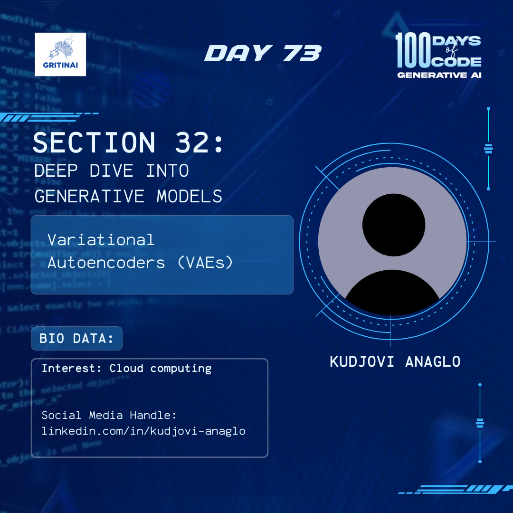

# Day 73

## Conditional GANs (CGANs)

Welcome to Day 73 of the 100 Days of Code challenge!

Today we will continue to explore CGANs and the need for this type of network. Some of the applications of CGANs include: 

* Image-to-Image Translation  
* Transform images from one set into images that could belong to another set.   
* Increase the resolution of images, adding detail where necessary to fill in blurry areas.   
* Take text as input and produce images as described by the text.

Click  [here](https://www.youtube.com/watch?v=W5NPlZzebO0&list=PLZsOBAyNTZwboR4_xj-n3K6XBTweC4YVD&t=1122s) to get started.

