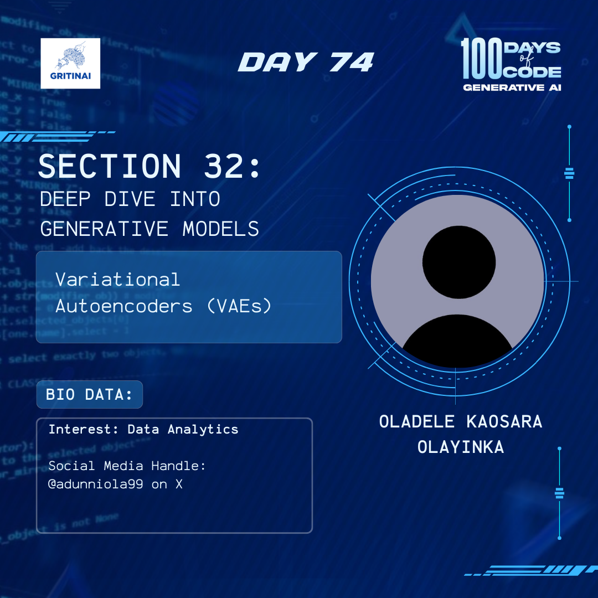

# Day 74

## Transformers I

Welcome to Day 74 of the 100 Days of Code challenge!

Today we will learn about transformers.   
Transformers are a type of deep learning model that have revolutionized the field of natural language processing (NLP) and beyond. 

Learn more about transformers [here](https://www.youtube.com/watch?v=wjZofJX0v4M)

