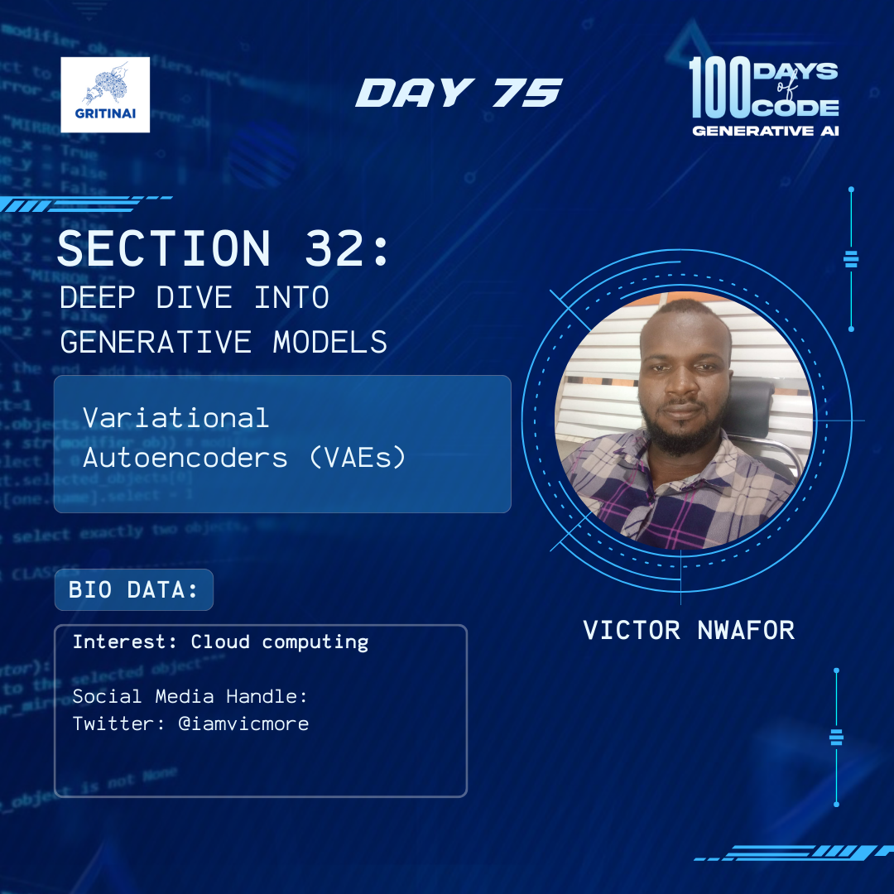

# Day 75

## Transformers I

Welcome to Day 75 of the 100 Days of Code challenge!

To complement what we have learnt yesterday, you can explore the  paper "Attention is All You Need" by Vaswani et al. in 2017\. The paper explains the concept of self-attention, which allows the model to weigh the importance of different input elements relative to each other.

Rewatch transformers [here](https://www.youtube.com/watch?v=wjZofJX0v4M)

